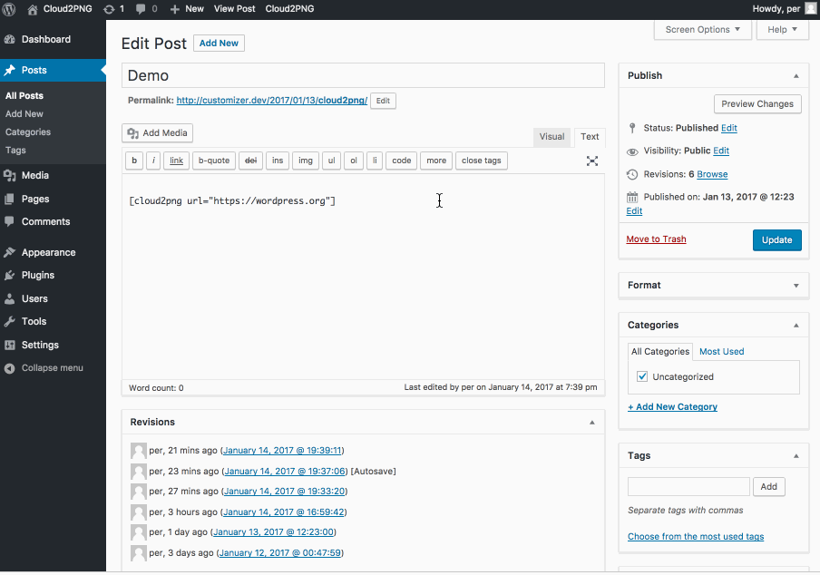

# Cloud2PNG

Capture snapshots of any website using Cloudinarys URL2PNG add-on.



## Prerequisites
- PHP 5.6 (I use PHP 7.x on my development server)
- A [Cloudinary account](https://cloudinary.com/signup)
- Enable the [Cloudinary URL2PNG add-on](https://cloudinary.com/console/addons#url2png)

## Installation

You know the drill, download, add and activate the plugin. It will add the Cloud2PNG admin menu entry at `Settings->Cloud2PNG`

Go to `Settings->Cloud2PNG`, and in `Settings` add `cloud name`, `api key` and `api secret`. You'll find them in the [Cloudinary Dashboard](https://cloudinary.com/console)

In the Cloud2PNG Settings you can also enable a link to Cloud2PNG Customizer from the Admin Bar.

## Use

Add link to the site you'd like to create a snappshot of, by using the `[cloud2png]` shortcode, eg: `[cloud2png url="https://wordpress.org"]`

## Customize the snapshots

Using the Cloud2PNG Customizer you can change the size and border of the snapshots.

## Sidenote

I code for fun, and I code to learn. I've tried to do this plugin using OOP at my best effort. There will be couplings that could be looser and not everything is DRY. I will update the plugin as I learn more and I will fix [issues that are reported](https://github.com/soderlind/cloud2png/issues/new).

I'm following the [WordPress Coding Standards](https://github.com/WordPress-Coding-Standards/WordPress-Coding-Standards) with one exception, I'm using the PSR-4 autoloader and I've disabled the following rules:
```xml
<rule ref="WordPress-Core">
	<exclude name="Generic.Files.LowercasedFilename" />
	<exclude name="WordPress.Files.FileName" />
	<exclude name="WordPress.Files.FileName.UnderscoresNotAllowed" />
</rule>
```

## Credits
Cloud2PNG is using:
- The [Plugin Customizer](https://github.com/soderlind/plugin-customizer) framework.
- The [WordPress Customizer Range Value Control](https://github.com/soderlind/class-customizer-range-value-control).
- The [PHP extension for Cloudinary](https://github.com/cloudinary/cloudinary_php)
- The [PSR-4 Autoloader](https://github.com/php-fig/fig-standards/blob/master/accepted/PSR-4-autoloader-examples.md#class-example)
- The jQuery [boxShadow cssHooks](https://github.com/brandonaaron/jquery-cssHooks/blob/master/boxshadow.js), Copyright (c) 2010 Burin Asavesna (http://helloburin.com)


## Copyright and License

Cloud2PNG is copyright 2017 Per Soderlind

Cloud2PNG is free software: you can redistribute it and/or modify it under the terms of the GNU General Public License as published by the Free Software Foundation, either version 2 of the License, or (at your option) any later version.

Cloud2PNG is distributed in the hope that it will be useful, but WITHOUT ANY WARRANTY; without even the implied warranty of MERCHANTABILITY or FITNESS FOR A PARTICULAR PURPOSE. See the GNU General Public License for more details.

You should have received a copy of the GNU Lesser General Public License along with the Extension. If not, see http://www.gnu.org/licenses/.
